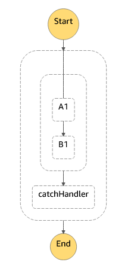
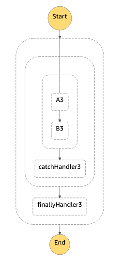
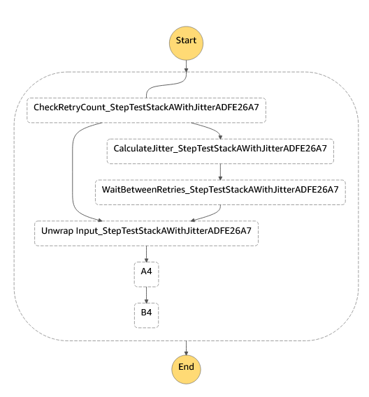

# cdk-stepfunctions-patterns [](https://github.com/kolomied/awesome-cdk)


[](https://badge.fury.io/js/cdk-stepfunctions-patterns)
[](https://badge.fury.io/py/cdk-stepfunctions-patterns)
[](https://badge.fury.io/nu/Talnakh.StepFunctions.Patterns)

*cdk-stepfunctions-patterns* library is a set of [AWS CDK](https://aws.amazon.com/cdk/) constructs that provide 
resiliency patterns implementation for AWS Step Functions.

All these patterns are *composable*, meaning that you can combine them together to create
quite complex state machines that are much easier to maintain and support than low-level
JSON definitions.

  * [Try / Catch](#try--catch-pattern)
  * [Try / Finally](#try--finally-pattern)
  * [Try / Catch / Finally](#try--catch--finally-pattern)
  * [Retry with backoff and jitter](#retry-with-backoff-and-jitter)
  * [Resilience lambda errors handling](#resilience-lambda-errors-handling)                                                                                                                                          
  * [Validation of proper resilience lambda errors handling](#validation-of-proper-resilience-lambda-errors-handling)   
  
## Try / Catch pattern
Step Functions support **Try / Catch** pattern natively with [Task](https://docs.aws.amazon.com/step-functions/latest/dg/amazon-states-language-task-state.html)
and [Parallel](https://docs.aws.amazon.com/step-functions/latest/dg/amazon-states-language-parallel-state.html) states. 

`TryTask` construct adds a high level abstraction that allows you to use Try / Catch pattern with any state or sequence of states.

### Example
```typescript
import * as sfn from '@aws-cdk/aws-stepfunctions';
import { TryTask } from 'cdk-stepfunctions-patterns';

// ...

new sfn.StateMachine(this, 'TryCatchStepMachine', {
  definition: new TryTask(this, "TryCatch", {
    tryProcess: new sfn.Pass(this, 'A1').next(new sfn.Pass(this, 'B1')),
    catchProcess: new sfn.Pass(this, 'catchHandler'),
    // optional configuration properties
    catchProps: {
      errors: ['Lambda.AWSLambdaException'],
      resultPath: "$.ErrorDetails"
    }
  })
})
```

### Resulting StepFunction



## Try / Finally pattern 
It is often useful to design state machine using **Try / Finally** pattern. The idea is to have a *Final* state that has to be 
executed regardless of successful or failed execution of the *Try* state. There may be some temporal resource you want 
to delete or notification to send.

Step Functions do not provide a native way to implement that pattern but it can be done using 
[Parallel](https://docs.aws.amazon.com/step-functions/latest/dg/amazon-states-language-parallel-state.html) state and *catch all* catch
specification.

`TryTask` construct abstracts these implementation details and allows to express the pattern directly.

### Example

```typescript
import * as sfn from '@aws-cdk/aws-stepfunctions';
import { TryTask } from 'cdk-stepfunctions-patterns';

// ...

new sfn.StateMachine(this, 'TryFinallyStepMachine', {
    definition: new TryTask(this, "TryFinally", {
        tryProcess: new sfn.Pass(this, 'A2').next(new sfn.Pass(this, 'B2')),
        finallyProcess: new sfn.Pass(this, 'finallyHandler'),
        // optional configuration properties
        finallyErrorPath: "$.FinallyErrorDetails"
    })
})
```

### Resulting StepFunction


## Try / Catch / Finally pattern
This is a combination of two previous patterns. `TryTask` construct allows you to express rather complex
error handling logic in a very compact form. 

### Example
```typescript
import * as sfn from '@aws-cdk/aws-stepfunctions';
import { TryTask } from 'cdk-stepfunctions-patterns';

// ...

new sfn.StateMachine(this, 'TryCatchFinallyStepMachine', {
    definition: new TryTask(this, "TryCatchFinalli", {
        tryProcess: new sfn.Pass(this, 'A3').next(new sfn.Pass(this, 'B3')),
        catchProcess: new sfn.Pass(this, 'catchHandler3'),
        finallyProcess: new sfn.Pass(this, 'finallyHandler3')
    })
})
```

### Resulting StepFunction


## Retry with backoff and jitter
Out of the box Step Functions retry implementation provides a way to configure backoff factor,
but there is no built in way to introduce jitter. As covered in 
[Exponential Backoff And Jitter](https://aws.amazon.com/blogs/architecture/exponential-backoff-and-jitter/)
and [Wait and Retry with Jittered Back-off](https://github.com/Polly-Contrib/Polly.Contrib.WaitAndRetry#wait-and-retry-with-jittered-back-off) this retry technique can be very helpful in high-load
scenarios.

`RetryWithJitterTask` construct provides a custom implementation of retry with backoff and 
jitter that you can use directly in your state machines. 

### Example
```typescript
import * as sfn from '@aws-cdk/aws-stepfunctions';
import { RetryWithJitterTask } from 'cdk-stepfunctions-patterns';

// ...

new sfn.StateMachine(this, 'RetryWithJitterStepMachine', {
    definition: new RetryWithJitterTask(this, "AWithJitter", {
        tryProcess: new sfn.Pass(this, 'A4').next(new sfn.Pass(this, 'B4')),
        retryProps: { errors: ["States.ALL"], maxAttempts: 3 }
    })
})
```

### Resulting StepFunction


## Resilience lambda errors handling
`LambdaInvoke` construct from [aws-stepfunctions-tasks](https://docs.aws.amazon.com/cdk/api/latest/docs/aws-stepfunctions-tasks-readme.html)
module is probably one of the most used ones. Still, handling of 
[AWS Lambda service exceptions](https://docs.aws.amazon.com/step-functions/latest/dg/bp-lambda-serviceexception.html) 
is often overlooked. 

`ResilientLambdaTask` is a drop-in replacement construct for `LambdaInvoke` that adds retry for the most common 
transient errors: 

 - Lambda.ServiceException
 - Lambda.AWSLambdaException
 - Lambda.SdkClientException
 - Lambda.TooManyRequestsException

 ### Example
```typescript
import * as lambda from '@aws-cdk/aws-lambda';
import { ResilientLambdaTask } from 'cdk-stepfunctions-patterns';

// ...

const lambdaFunction = new lambda.Function(this, 'LambdaFunction', {
    // ... removed for clarity
});

const calculateJitterTask = new ResilientLambdaTask(this, "InvokeLambda", {
    lambdaFunction: lambdaFunction  
})
```

That would result in the following state definition:

```json
"InvokeLambda": {
    "Type": "Task",
    "Resource": "arn:aws:states:::lambda:invoke",
    "Parameters": {
        "FunctionName": "<ARN of lambda function>"
    },
    "Retry": [{
        "ErrorEquals": [
        "Lambda.ServiceException",
        "Lambda.AWSLambdaException",
        "Lambda.SdkClientException",
        "Lambda.TooManyRequestsException"
        ],
        "IntervalSeconds": 2,
        "MaxAttempts": 6,
        "BackoffRate": 2
    }]
}
```

## Validation of proper resilience lambda errors handling
It is often a challenge to enforce consistent transient error handling across all state machines of a large
application. To help with that, *cdk-stepfuctions-patterns* provides a [CDK aspect](https://docs.aws.amazon.com/cdk/latest/guide/aspects.html)
to verify that all Lambda invocations correctly handle transient errors from AWS Lambda service.

Use `ResilienceLambdaChecker` aspect as shown below.

 ### Example
```typescript
import * as cdk from '@aws-cdk/core';
import { ResilienceLambdaChecker } from 'cdk-stepfunctions-patterns'

const app = new cdk.App();
// ...

// validate compliance rules
app.node.applyAspect(new ResilienceLambdaChecker());
```

If there are some states in your application that do not retry transient errors or miss some recommended
error codes, there will be warning during CDK synthesize stage:

```
PS C:\Dev\GitHub\cdk-stepfunctions-patterns> cdk synth --strict
[Warning at /StepFunctionsPatterns/A] No retry for AWS Lambda transient errors defined - consider using ResilientLambdaTask construct.
[Warning at /StepFunctionsPatterns/B] Missing retry for transient errors: Lambda.AWSLambdaException,Lambda.SdkClientException.
```
